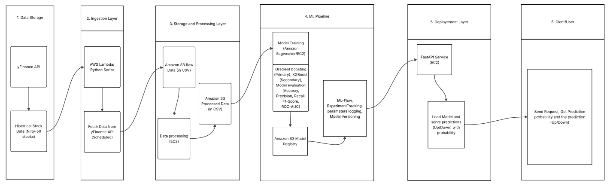
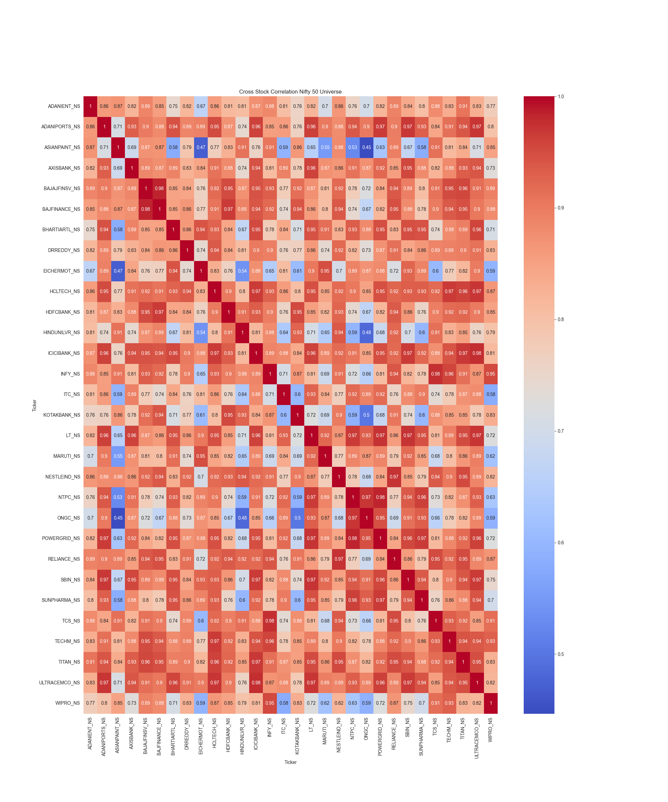
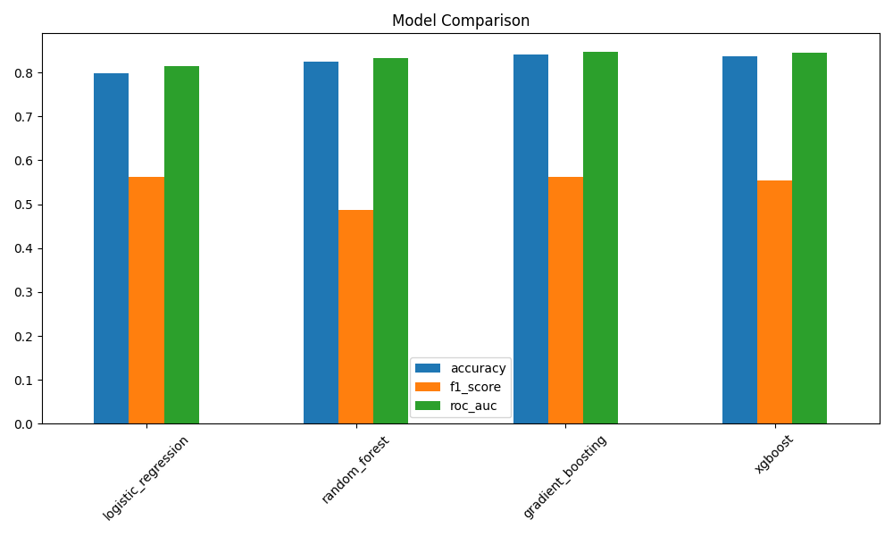

# 📊 Automated Financial MLOps Platform  
## multi-Asset Stock Direction Prediction System
## 🚀 Live Deployment
Deployed on AWS EC2 using FastAPI, Gunicorn, and Nginx.
---
API Endpoint Panel: [http://3.109.214.89]
---
API Docs (Swagger) Panel: [http://3.109.214.89/docs]
---
For Advanced EDA report, please refer to: [ADVANCED EDA REPORT](docs/observations/advanced_eda_report.md)
---
For Phases & Work log, please refer to: [WORK LOG DOCUMENT](work_logs/work_log.md)
---
For Market research & Insights, please refer to: [MARKET RESEARCH](market_research/market_research.md)
---
## 🚀 Overview

This project presents a **production-oriented Financial MLOps Platform** designed to predict the **next-day direction of stock prices (up/down)** across multiple assets.

The system integrates:

- 📈 Financial time-series analysis  
- 🤖 Machine Learning modeling  
- ⚙️ End-to-End MLOps pipeline  

It transforms raw market data into **actionable predictive insights** using a scalable and modular architecture.

---

## 🎯 Problem Statement

Financial markets are highly dynamic and influenced by multiple factors, making accurate prediction of short-term price movement a challenging task.

This project formulates the problem as a **binary classification task**:

- `1` → Price expected to increase  
- `0` → Price expected to decrease  

The goal is to enable **data-driven trading insights** through automation and machine learning.

---

## 🧠 Solution Approach

The system follows a structured pipeline:

Key highlights:

- Multi-asset dataset (30 Nifty-50 stocks)  
- ~10 years of historical OHLCV data  
- Feature engineering using rolling statistics  
- Modular prediction pipeline for scalability  

---

## 🏗️ Architecture Overview




---

## 📊 Exploratory Data Analysis (EDA)

A comprehensive EDA was conducted to understand:

- Data distribution and trends  
- Missing values and data quality  
- Correlation between financial variables  
- Volatility patterns  


### 🔹 Correlation Heatmap



---

## ⚙️ Feature Engineering

Key engineered features:

- Returns (percentage change)  
- Moving Averages (7-day, 30-day)  
- Volatility (rolling standard deviation)  
- Lag features (previous day dependency)  

These features help capture:

- Market trends  
- Momentum  
- Volatility behavior  

---

## 🤖 Model Development

The system is built as a **binary classification model** for predicting next-day market direction.

### 📌 Evaluation Metrics

- Accuracy  
- Precision  
- Recall  
- F1-score  
- ROC-AUC  




---
## Results

| Model | Accuracy | F1 Score | ROC-AUC |
|------|--------|---------|--------|
| Gradient Boosting | 0.84 | 0.56 | 0.84 |
| XGBoost | 0.83 | 0.55 | 0.84 |
---

## 🔮 Prediction Pipeline

A reusable prediction pipeline enables real-time inference.

### Example:

```python
from pipeline.prediction_pipeline import PredictionPipeline
import pandas as pd

pipeline = PredictionPipeline()

sample = {
    "Close": 150.0,
    "High": 152.0,
    "Low": 148.0,
    "Open": 149.5,
    "Volume": 1000000,
    "Returns": 0.01,
    "Ma_7": 148.5,
    "Ma_30": 145.0,
    "Volatility": 0.02,
    "Lag_1": 0.005
}

df = pd.DataFrame([sample])

preds, probs = pipeline.predict(df)

print("Prediction:", preds)
print("Probability:", probs)


---
