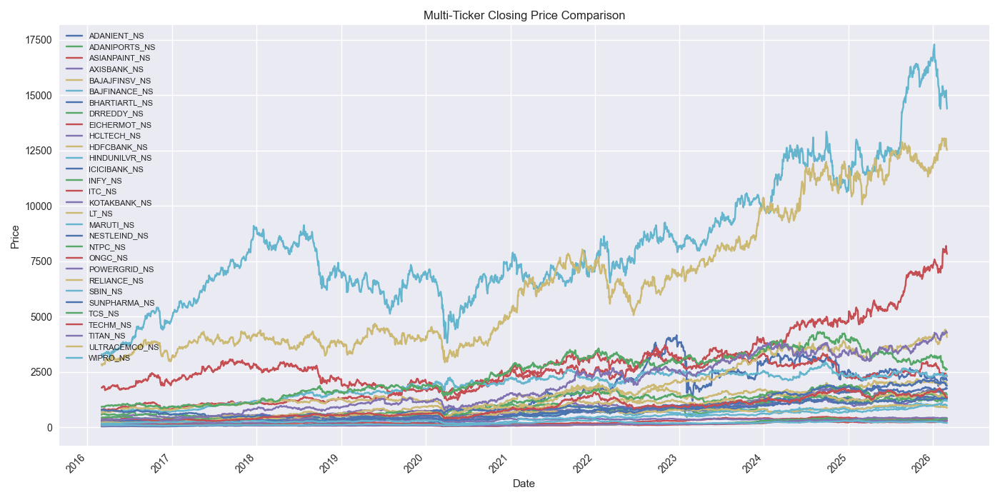
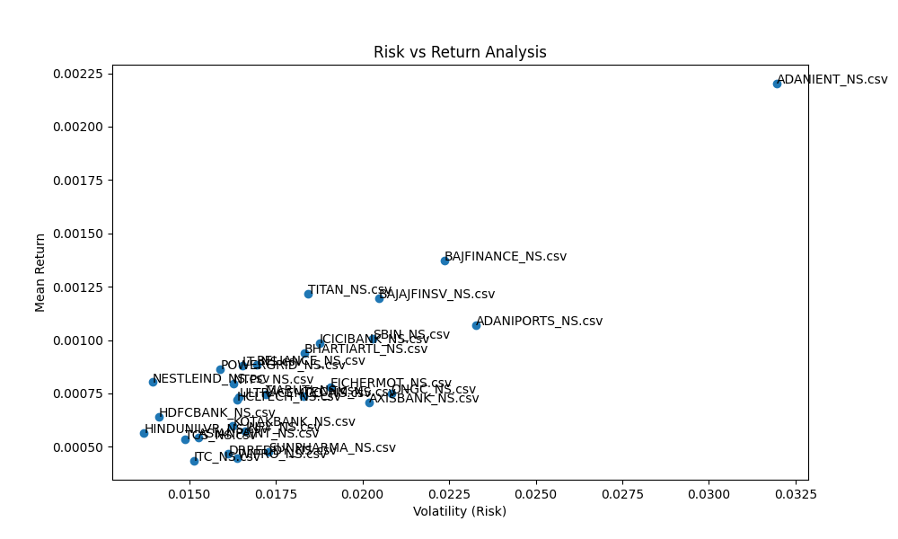

# Advanced EDA Report – Automated Financial MLOps Platform

---

## 1. Problem Overview

This project focuses on solving a financial prediction problem using machine learning.  
The primary objective is to build a system that can:

- Predict: Future Return (Closing Price)  
- Based on: Last Close Price, High, Low, Open, Volume, Returns, Ma_7, Ma_30, Volatility, Lag_1  

The solution is designed not only to achieve high predictive performance but also to be integrated into an automated MLOps pipeline for scalability and deployment.

---

## 2. Dataset Description

- **Dataset Source**: Yahoo Finance  
- **Number of Records**: 74100 (Combined 30 large sets)
- **Number of Features**: 7  

### Target Variable
- **Name**: Close  
- **Type**: Regression & Classification  
- **Description**: In financial context, "Close" attribute shows the final return from the respective stock.  

### Feature Types
- **Numerical Features**: Close, High, Low, Open, Volume  
- **Categorical Features**: Ticker 
- **Datetime Features (if any)**: Date (Object)

---

## 3. Data Quality Analysis

### Missing Values
- Presence of missing values: No    

### Duplicate Records
- Duplicate rows found: No Any  

### Data Consistency
- Observations:
  - There were no any Missing values recorded in any of the datasets.

### Distribution 
- Observations:
  - The distribution of *OHLCV* attributes shows that all the distributions are abnormally          distributed and all are right skewed, i.e. the positive skewness of the data. 
  - There is **No single Gaussian Curve observed**.
### Outliars Detection
- Observations:
  - Some datasets like: ADANIENT_NS.csv or etc. has outliars in the "Volume" attriute in it majorly.
  - The further data preprocessing strategy making has been performed in the notebook:  
**[02_cleaning_and_preprocessing_strategy](../../notebooks/02_data_cleaning_and_preprocessing_strategy/)**.

### Time Series Analysis
- Observations:
  - According to **Price Trends** almost all stocks shows the up-trend in the price, **there was the market crash observed in the year slot of 2020**, the market research and the past informations shows that it was due to **Covid-19 Pandemic** which is the most possible reasons of market crash.
  - Overall **ADANIENT_NS** i.e. **Adani Enterprises** performed very well in past 10-years time-series; always **followed an up-trend**.
  - According to **Multi-ticker Combined Price Trends** the combined tickers also shows the growth of **ADANIENT** i.e. **Adani Enterprises**
  

### Correlation Analysis
- Observations:
  - According to **Correlation Heatmap** all columns are 100% correlated with each other in a positive correlation; except the "Volumne" column of all individual dataset that shows the **Negative correlations** with all other 4 atributes. It means **Open, High, Low and close affects each other directly and perfectly in a positive manner but negavitely to Volume attribute**.
  - Whenever **Open, High, Low and Close increased, Volume decreased**.

### Return and Risk Analysis
- Observations:
  - Overall **ADANIENT** i.e. **Adani Enterprises** shows **high return in high risk**.
  - Whereas **BAJFINANCE** i.e. **Bajaj Finance** holds **2nd Positions overall**.

---

### Key Observations

- All the datasets are free with missing values and the duplicated values.
- All attributes of all 30 datasets are having thier original and required datatype, so there is **no need for the type-casting**.
- The distribution of attributes shows that the OHLCV is **skewed towards right** and which shows the **positive skewness** of the attributes.
- There are **no single Gaussian curve** observed in the distribution.
- Some datasets are having outliars in their **Volume** column which has been treated in [Data Cleaning](../../src/data_cleaning.py).
- Overall in **Time-series analysis** the dataset: **BAJAJFINANCE_NS** shows the overall positive growth.
- According to Correlation Heatmap all columns are 100% correlated with each other in a positive correlation; except the "Volumne" column of all individual dataset that shows the Negative correlations with all other 4 atributes. It means Open, High, Low and close affects each other directly and perfectly in a positive manner but negavitely to Volume attribute.
- Overall ADANIENT i.e. Adani Enterprises shows high return in high risk. Whereas BAJFINANCE i.e. Bajaj Finance holds 2nd Positions overall.
---
